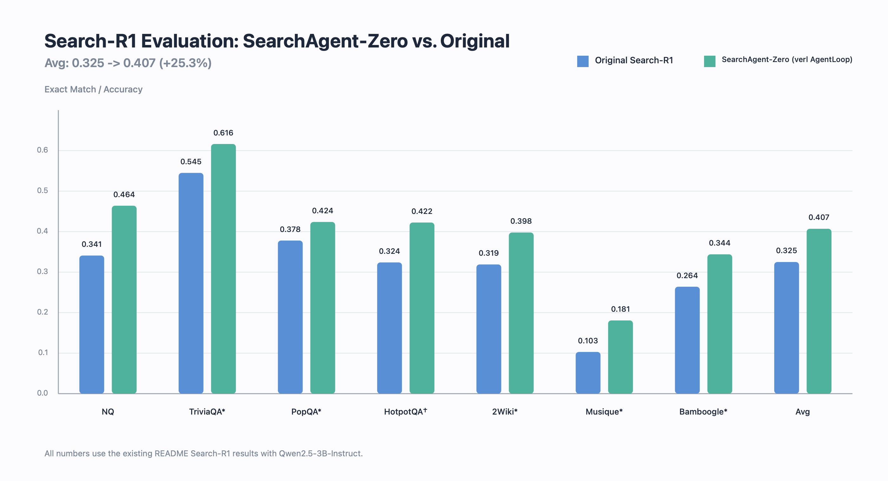
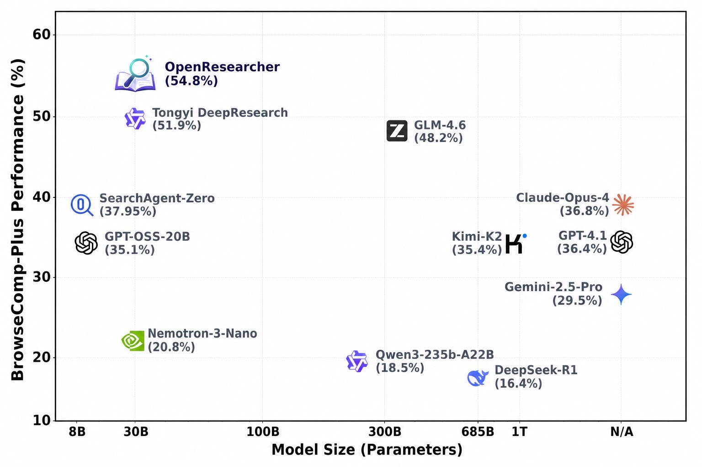

# SearchAgent-Zero: A Scalable Multi-Turn Search Agent RL Framework

[中文文档](README_zh.md)

SearchAgent-Zero is a verl-based reinforcement learning framework for training search agents, covering both short-horizon Search-R1-style QA and long-horizon ASearch-style multi-turn search.

It provides a reproducible training recipe with multi-turn tool calling, retrieval services, abnormal trajectory handling, summary compression, and synchronous/asynchronous RL training. The goal is to make Search Agent RL easier to reproduce, scale, and extend.

## News

- **[2026/05/24] We SearchAgent-Zero releases [SearchAgent-Zero: A Scalable Multi-Turn Search Agent RL Framework](https://zhuanlan.zhihu.com/p/2042036895199278392) .** The Search-R1 recipe improves the average score on the full Search-R1 evaluation suite from `0.325` to `0.407` with Qwen2.5-3B-Instruct. The ASearch recipe scales to long-horizon search: SearchAgent-Zero (Qwen3-8B, 300 steps) reaches `37.95%` Accuracy and `50.87%` Recall on BrowseComp-Plus, achieving SOTA among models below 14B parameters. See `examples/search_agent_rl/`, `verl/experimental/agent_loop/`, and `verl/tools/search_tool.py` for implementation details.

## Key Features
- **Stable and scalable RL infrastructure**: Built on the latest verl RL infrastructure and GRPO training pipeline, SearchAgent-Zero has been validated on Search-R1-style search agent training and can scale to longer multi-turn search trajectories without the rollout crashes observed in the original framework.
- **Abnormal trajectory monitoring**: Tracks Search Agent-specific metrics during training, including tool call success rate, average search turns, repeated queries, excessive parallel queries, tool parsing failures, and trajectory truncation.
- **Abnormal trajectory filtering and credit assignment**: Filters or penalizes low-quality trajectories such as repeated searches, too many parallel queries in one turn, and malformed tool calls. When an abnormal event occurs in only one tool-call turn, only the tokens related to that turn are penalized, reducing unintended punishment of earlier valid search behavior.
- **Search result summary compression**: Supports self-summary and external-summary to preserve key information across more search turns within a limited context budget.
- **Synchronous and fully async training**: Provides a standard GRPO training script and a fully async policy training entrypoint for exploring higher-throughput long-horizon Search Agent RL.

## Results

### Search-R1

Under the Search-R1 setting, SearchAgent-Zero reproduces the task with Qwen2.5-3B-Instruct and the same training data. Compared with the original Search-R1 results, training with verl AgentLoop achieves consistent gains across multiple open-domain QA datasets.



| Dataset | Search-R1 (Qwen2.5-3B-Instruct) | verl AgentLoop Reproduction (Qwen2.5-3B-Instruct) | Abs. Gain | Rel. Gain |
| --- | ---: | ---: | ---: | ---: |
| NQ | 0.341 | 0.4640 | +0.1230 | +36.1% |
| TriviaQA* | 0.545 | 0.6164 | +0.0714 | +13.1% |
| PopQA* | 0.378 | 0.4239 | +0.0459 | +12.1% |
| HotpotQA† | 0.324 | 0.4225 | +0.0985 | +30.4% |
| 2Wiki* | 0.319 | 0.3979 | +0.0789 | +24.7% |
| Musique* | 0.103 | 0.1808 | +0.0778 | +75.5% |
| Bamboogle* | 0.264 | 0.3440 | +0.0800 | +30.3% |
| Avg | 0.325 | 0.40707 | +0.08207 | +25.3% |

Across the full Search-R1 evaluation suite, SearchAgent-Zero improves the average score from `0.325` to about `0.407`, with positive gains on every dataset. This shows that stable RL infrastructure, AgentLoop rollout, and abnormal trajectory handling can significantly affect Search Agent training quality.

### BrowseComp-Plus

In the longer-horizon BrowseComp-Plus search setting, Qwen3-8B learns a more proactive multi-turn search strategy through pure RL. With self-summary and credit-assignment-based abnormal trajectory filtering, the model can scale to more search turns under a fixed context budget. In the table below, the first two trained models are 100-step results, while `SearchAgent-Zero (300 step)` is the 300-step training result.



| Setting | Accuracy | Recall | Average Search Count |
| --- | ---: | ---: | ---: |
| Qwen3-32B base | 10.72% | 7.28% | 0.94 |
| Qwen3-8B + abnormal trajectory filtering + self-summary (100 step) | 24.21% | 33.14% | 10.11 |
| Qwen3-8B + credit-assignment abnormal trajectory filtering + self-summary (100 step) | 28.19% | 40.10% | 14.22 |
| SearchAgent-Zero (300 step) | 37.95% | 50.87% | 38.47 |

The results show that SearchAgent-Zero improves benchmark performance and, more importantly, demonstrates that Search Agent RL can stably scale up to multi-turn search settings.

## Quick Start

### 1. Install the training environment

We recommend following the official verl installation workflow and using a fresh conda environment. Inference backends such as vLLM and SGLang often impose strict PyTorch version constraints, so install the training/inference backend dependencies first, then install this repository with `--no-deps`.

```bash
# Run from the repository root.
conda create -n verl python==3.12 -y
conda activate verl

# SearchAgent-Zero uses FSDP/FSDP2 by default. See the optional command below for Megatron.
USE_MEGATRON=0 bash scripts/install_vllm_sglang_mcore.sh
pip install --no-deps -e .
pre-commit install
```

To use the Megatron backend, install the full dependency set:

```bash
bash scripts/install_vllm_sglang_mcore.sh
```

If your CUDA, PyTorch, vLLM, or SGLang version differs from the script defaults, adjust the script for your machine before running it.

### 2. Install the retriever environment

The local dense retriever is best run in a separate conda environment. The GPU version is better suited for RL rollout speed and retrieval quality. The CPU version can be used for simple connectivity tests, but may affect training performance.

```bash
conda create -n retriever python=3.10 -y
conda activate retriever

conda install pytorch==2.4.0 torchvision==0.19.0 torchaudio==2.4.0 pytorch-cuda=12.1 -c pytorch -c nvidia -y
pip install transformers datasets pyserini huggingface_hub uvicorn fastapi
conda install faiss-gpu=1.8.0 -c pytorch -c nvidia -y
```

### 3. Start the local search service

SearchAgent-Zero uses a Wikipedia corpus and E5 dense index by default. The corpus and index are large, so make sure you have enough disk space.

```bash
# Run from the repository root.
conda activate retriever

save_path=examples/search_agent_rl/local_dense_retriever/search_data
python examples/search_agent_rl/local_dense_retriever/download.py --save_path "$save_path"
cat "$save_path"/part_* > "$save_path"/e5_Flat.index
gzip -dk "$save_path"/wiki-18.jsonl.gz
```

Start the retrieval service:

```bash
conda activate retriever

CUDA_VISIBLE_DEVICES=0,1,2,3 bash examples/search_agent_rl/local_dense_retriever/start_retrieval.sh
```

The default service endpoint is:

```text
http://127.0.0.1:8000/retrieve
```

To replace it with a custom retrieval service, modify:

```text
examples/search_agent_rl/config/tool_config/search_tool_config.yaml
```

The retriever request/response format follows the Search-R1 style:

```python
# request
{
    "queries": ["What is Python?", "Tell me about neural networks."],
    "topk": 3,
    "return_scores": True
}

# response
{
    "result": [
        [
            {"document": "...", "score": 0.9}
        ]
    ]
}
```

## Datasets

### Search-R1 dataset

The Search-R1 recipe uses `PeterJinGo/nq_hotpotqa_train`, covering open-domain QA tasks such as NQ and HotpotQA. It is suitable for reproducing short-horizon reasoning + search training.

Preprocess the data:

```bash
conda activate verl

bash examples/search_agent_rl/preprocess_search_r1_dataset_new.sh
```

Default outputs:

```text
examples/search_agent_rl/search_r1_processed/train_search_r1.parquet
examples/search_agent_rl/search_r1_processed/test_search_r1.parquet
```

Start training:

```bash
conda activate verl
export CUDA_VISIBLE_DEVICES=0,1,2,3,4,5,6,7
export WANDB_API_KEY=YOUR_WANDB_API_KEY

bash run_qwen2.5_3b_instruct_search_multiturn_SearchR1.sh
```

For evaluation only, run:

```bash
bash run_qwen2.5_3b_instruct_search_multiturn_SearchR1_eval.sh
```

### ASearcher dataset

The ASearch recipe uses `aidenjhwu/ASearcher_en_no-math_Qwen3-8B-reject-sample`, which is better suited for training long-horizon multi-turn search agents. The data is split into train/test sets and converted into verl's multi-turn tool-calling format.

Preprocess the data:

```bash
conda activate verl

bash examples/search_agent_rl/preprocess_ASearcher_dataset.sh
```

Default outputs:

```text
examples/search_agent_rl/ASearcher/ASearcher_train.parquet
examples/search_agent_rl/ASearcher/ASearcher_test.parquet
```

Start synchronous GRPO training:

```bash
conda activate verl
export CUDA_VISIBLE_DEVICES=0,1,2,3,4,5,6,7
export WANDB_API_KEY=YOUR_WANDB_API_KEY

bash run_qwen3_8b_instruct_search_multiturn_ASearch.sh
```

Start fully async training:

```bash
conda activate verl
export CUDA_VISIBLE_DEVICES=0,1,2,3,4,5,6,7
export WANDB_API_KEY=YOUR_WANDB_API_KEY

bash run_qwen3_8b_instruct_search_multiturn_ASearch_fully_async.sh
```

## Configuration

Core configuration files:

```text
examples/search_agent_rl/config/search_multiturn_grpo.yaml
examples/search_agent_rl/config/tool_config/search_tool_config.yaml
examples/search_agent_rl/config/agent_loop/tool_agent_credit_assignment.yaml
```

Key switches include:

- `actor_rollout_ref.rollout.multi_turn.enable=True`: enables multi-turn tool calling.
- `actor_rollout_ref.rollout.agent.default_agent_loop=tool_agent`: uses the tool AgentLoop.
- `actor_rollout_ref.rollout.multi_turn.tool_config_path`: specifies the search tool configuration.
- `actor_rollout_ref.rollout.multi_turn.enable_tool_response_summary=True`: enables search result summary.
- `actor_rollout_ref.rollout.multi_turn.summary_use_external_model=False`: uses self-summary by default.
- `actor_rollout_ref.rollout.multi_turn.max_queries_per_tool_call`: controls the maximum number of parallel queries in one turn.
- `actor_rollout_ref.rollout.multi_turn.turn_limit_schedule`: controls the schedule for the maximum number of search turns during training.

## Metrics

SearchAgent-Zero adds finer-grained training metrics for Search Agent RL, making it easier to determine whether the model has actually learned stable search behavior.

| Metric | Meaning |
| --- | --- |
| `turn/tool_call_success_rate/mean` | Tool call success rate |
| `turn/tool_call_turn/mean` | Average number of tool-call turns |
| `turn/tool_call_success_counts/mean` | Number of successful search queries |
| `turn/all_call_tool_counts/mean` | Total number of search queries |
| `abnormal_trajectory/tool_parser_error_count_percentage` | Percentage of malformed tool calls |
| `abnormal_trajectory/searched_query_count_percentage` | Percentage of repeated search queries |
| `abnormal_trajectory/too_many_tool_call_count_percentage` | Percentage of turns with too many parallel queries |
| `abnormal_trajectory/duplicate_search_result_count_percentage` | Percentage of search results with no incremental information |
| `abnormal_trajectory/too_many_turn_count_percentage` | Percentage of trajectories exceeding the maximum turn limit |
| `abnormal_trajectory/too_long_seq_truncated_count_percentage` | Percentage of trajectories truncated due to excessive length |
| `abnormal_trajectory/response_truncated_count_percentage` | Percentage of single-turn responses that were truncated |

These metrics help distinguish three types of issues: unstable environments, malformed tool calls, and policy degradation. For long-horizon search training, we recommend tracking reward, average search turns, number of search queries, abnormal trajectory ratio, and response length together.

## Project Structure

```text
examples/search_agent_rl/
  config/
    search_multiturn_grpo.yaml
    tool_config/search_tool_config.yaml
    agent_loop/tool_agent_credit_assignment.yaml
  local_dense_retriever/
    download.py
    retrieval_server.py
    start_retrieval.sh
  preprocess_search_r1_dataset_new.sh
  preprocess_ASearcher_dataset.sh

run_qwen2.5_3b_instruct_search_multiturn_SearchR1.sh
run_qwen2.5_3b_instruct_search_multiturn_SearchR1_eval.sh
run_qwen3_8b_instruct_search_multiturn_ASearch.sh
run_qwen3_8b_instruct_search_multiturn_ASearch_fully_async.sh

verl/experimental/agent_loop/
verl/tools/search_tool.py
```

## Citation

If SearchAgent-Zero helps your research or engineering work, please consider citing it:

```bibtex
@software{li2026searchagentzero,
  title  = {SearchAgent-Zero: Scalable Reinforcement Learning for Multi-Turn Search Agents},
  author = {Li, Jiacheng},
  url    = {https://github.com/verl-project/verl},
  year   = {2026}
}
```

## Acknowledgement

During development, we borrowed from or built on the implementations of the following projects. We sincerely appreciate these teams for their contributions to open-source research and development.

- [verl](https://github.com/verl-project/verl)
- [Search-R1](https://github.com/PeterGriffinJin/Search-R1)
- [Cut the Bill, Keep the Turns: Affordable Multi-Turn Search RL](https://agate-slipper-ef0.notion.site/Cut-the-Bill-Keep-the-Turns-Affordable-Multi-Turn-Search-RL-003f78214a4d451fb06f453d084e666c)
